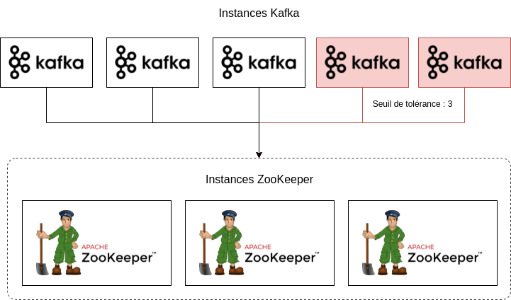

# kafka-cluster-ha-k8s
Exécution d'un cluster Kafka résilient et hautement disponible

Description du projet

La description du projet permet de fournir tout un ensemble d'information par rapport au contexte et au secteur cible. Certaines informations essentielles, comme les contraintes du projet ou encore les objectifs à atteindre, y sont définies.

Une startup propose une plateforme SaaS (abonnement mensuel) avec des dizaines de milliers d'utilisateurs connectés en même temps. Cette plateforme est très interactive dans le sans où les utilisateurs interagissent avec de nombreuses composantes. Pour mieux comprendre le comportement de ses utilisateurs, la startup souhaite collecter toutes les activités utilisateurs (pages vues, bouton cliqué, temps resté sur une page) et conserver ces informations dans une base de données.

Il a été estimé que l'ensemble des événements utilisateurs pourrait générer un débit de données de l'ordre de 100 Mo/s. Bien qu'une partie de ces données sera traité, la startup souhaite mettre en place un système capable de gérer cette quantité de données avec un faible couplage entre les applications pour éviter les goulots d'étranglement (bottleneck).

Pour cela, la startup a décidé de mettre en place un cluster Kafka qui puisse supporter la charge de 100 Mo/s afin de permettre aux applications qui consomment ces données de ne pas être saturées.

Contraintes

Le cluster Kafka devra être en mesure de gérer des données dans un environnement de production : la perte de données doit être la plus minimale possible, ce qui signifie que la disponibilité du cluster Kafka doit être la plus élevée possible.

    Le cluster devra disposer d'au minimum 3 brokers Kafka en exécution, avec 5 brokers Kafka en régime constant.
    Le cluster devra exécuter constamment 3 instances ZooKeeper.
    En cas d'échec, le temps d'interruption maximale doit être de 60 secondes.
    Aucune configuration SSL n'est nécessaire, et le mode de communication sera PLAINTEXT.
    Il n'y a pas de méthode d'authentification sur les brokers Kafka.

Pour des raisons de résilience, les instances ZooKeeper devront être séparées des instances Kafka.

L'équipe IT souhaite pouvoir gérer de manière automatisée le cluster. Le provisionnement des ressources et des instances devra être géré par un outil d'automatisation ou une plateforme d'orchestration. La startup propose alors deux possibilités pour le Data Engineer.

    Utiliser des d'outils infrastructure as code (IaC) tel que Terraform et Ansible pour lancer les instances.
    Utiliser la plateforme Kubernetes pour exécuter le cluster.

Dans le cadre du projet, les ressources des brokers pourront être faibles (quelques dizaines de Go d'espace disque, 1 CPU t 1 Go mémoire par broker), car la startup pour redimensionner les ressources de manière automatisée.

La startup ne souhaite pas utiliser des services Kafka managés de fournisseurs Cloud.

[def]: kafka_cluster_diagram.png